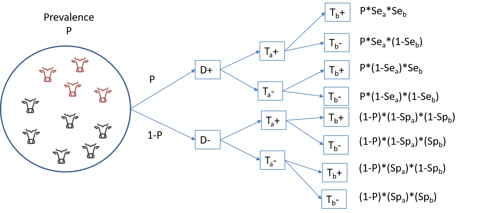

```{r include=FALSE}
# automatically create a bib database for R packages
knitr::write_bib(c(
  .packages(), 'bookdown', 'knitr', 'rmarkdown'
), 'packages.bib')
```


# Two imperfect tests
When using two imperfect diagnostic tests on the same population, we will have to use a Bayesian latent class model (**LCM**) to estimate the true disease prevalence, and the sensitivity and specificity of both diagnostic tests. Two different approaches could be used. The simplest approach would be to consider that the two diagnostic tests are independent conditionally on the true health status of the individuals. Conditional independence can be defined as:  
  
*Two tests are conditionally independent when the sensitivity (or specificity) of one test does not depend on whether the results of another test are positive or negative among infected (or non-infected) individuals.* [Cheung et al., 2021](https://doi.org/10.20506/rst.40.1.3224)  
  
In many situations, however, we will use two diagnostic tests that make use of the same biological process. For instance, an ELISA test could measure antibodies against a given pathogen in blood and another test could also measure antibodies, but in milk. In such case, it would be difficult to pretend that:  
  
*The sensitivity of the milk test does not depend on whether the results of the blood test are positive or negative among infected individuals.*  
  
In such case, it would be better to consider a LCM where conditional dependence between tests is possible. Note that, even for tests that make use of very different biological processes, it is rather difficult (or, actually, often impossible) to "demonstrate" conditional independence between them. So, if doable, allowing for a potential conditional dependence between tests would be a more robust strategy.  
  
## Assuming conditional independence
When two tests are conditionally independent, then obtaining a given combination of results to Test A and Test B, as function of the true disease prevalence (*P*) and of the accuracy of each test (*SeA*, *SpA*, *SeB*, *SpB*) can be described as illustrated below:  
  

  
From that illustration, we can deduce that the probability of testing positive to both tests is the sum of the first and fifth rows:  
  
$P(TestA+ TestB+) = P*SeA*SeB + (1-P)*(1-SpA)*(1-SpB)$  
  
Or, putted in words, it is the probability of being a truly diseased individual and of being identified as such by both tests ($P*SeA*SeB$), plus the probability of being a healthy individual and being misdiagnosed as diseased by both tests ($(1-P)*(1-SpA)*(1-SpB)$). If we extend this reasoning to all tests combination possibilities, we get:  
  
$P(TestA+TestB+) = P*SeA*SeB + (1-P)*(1-SpA)*(1-SpB)$  
$P(TestA+TestB-) = P*SeA*(1-SeB) + (1-P)*(1-SpA)*SpB$  
$P(TestA-TestB+) = P*(1-SeA)*SeB + (1-P)*SpA*(1-SpB)$  
$P(TestA-TestB-) = P*(1-SeA)*(1-SeB) + (1-P)*SpA*SpB$  
  
When applying two diagnostic tests on a given population, the data generated can be presented very simply as the number of individuals in each cell of the 2x2 table presenting the cross-classified results of the two tests:  
  
```{r echo=FALSE, warning=FALSE, message=FALSE}
#Créer une table
Results <- c("Test B+", "Test B-")
TestA_positive <- c("n1","n2")
TestA_negative <- c("n3","n4")
dp_data2 <- data.frame(Results, TestA_positive, TestA_negative)
```
```{r echo=FALSE, warning=FALSE, message=FALSE}
library(knitr)
library(kableExtra)
kable(dp_data2, col.names=c(" ", "Test A+", "Test A-"), caption="Cross-classified results from two diagnostic tests")%>%
  kable_styling()
```
  
Thus, the likelihood function that could link the observed data (*n1*, *n2*, *n3*, *n4*) to the unknown parameters (*P*, *SeA*, *SeB*, *SpA*, *SpB*) could be defined as follows, using a multinomial distribution: 
  
$n[1:4] \sim dmulti(P[1:4], n)$ 
  
$P1 = P*SeA*SeB + (1-P)*(1-SpA)*(1-SpB)$  
$P2 = P*SeA*(1-SeB) + (1-P)*(1-SpA)*SpB$  
$P3 = P*(1-SeA)*SeB + (1-P)*SpA*(1-SpB)$  
$P4 = P*(1-SeA)*(1-SeB) + (1-P)*SpA*SpB$  
  
Again, if we put that in words, the number of individuals in cell *n1* (i.e., TestA+ and TestB+) is determined by the number of individuals tested (*n*) and the probability (*P1*) of falling in that cell. The latter itself depends on the true prevalence of disease in the population (*P*), and on each of the two tests sensitivity (*SeA* and *SeB*) and specificity (*SpA* and *SpB*). We can use similar reasoning for *n2*, *n3*, and *n4*. Finally, the multinomial distribution would further impose that the four probabilities (*P1*, *P2*, *P3*, and *P4*) have to sum up to 1.0 (i.e., 100%). 
  
In such a model, we will have five unknown parameters to estimate (*P*, *SeA*, *SeB*, *SpA*, *SpB*), but only four equations. Thus, the model will be "non-identifiable", and we will need to provide informative priors on, at least, two parameters. Often, we will provide priors on the Se and Sp of one of the tests, and/or on disease prevalence.  
  
To run such a model, we simply need to provide a dataset where *n1*, *n2*, *n3*, and *n4* are listed (in that order).  
  
```{r}
#n is of the form : (TestA pos and TestB pos), (TestA pos and TestB neg), (TestA neg and TestB pos), then (TestA neg and TestB neg)
datalist <- list(n=c(138,1,10,113))
```
  
Moreover, we will need the following information to generate the *a* and *b* shape parameters of the various distributions. These values will be included in the text file presenting the `JAGS` model. Note that we have made use below of the `paste0()` function to produce a model in which you could modify the tests "labels". You could thus use the `JAGS` model that will be described next as a generic model for various diagnostic tests, and still obtain "meaningful" outputs.  
  
```{r}
#We could first create labels for TestA and TestB
TestA <- "US"
TestB <- "PAG"

#Provide information for the prior distributions (all beta distributions) for the 5 unknown parameters 
#Below, we have used informative priors for Prev, and Se and Sp of Test A. The values used are not seldom important at this stage.
Prev.shapea <- 4.2         #a shape parameter for Prev    
Prev.shapeb <- 5.4         #b shape parameter for Prev

Se.TestA.shapea <- 131     #a shape parameter for Se of TestA
Se.TestA.shapeb <- 15      #b shape parameter for Se of TestA
Sp.TestA.shapea <- 100     #a shape parameter for Sp of TestA
Sp.TestA.shapeb <- 6       #b shape parameter for Sp of TestA

Se.TestB.shapea <- 1       #a shape parameter for Se of TestB
Se.TestB.shapeb <- 1       #b shape parameter for Se of TestB
Sp.TestB.shapea <- 1       #a shape parameter for Sp of TestB
Sp.TestB.shapeb <- 1       #b shape parameter for Sp of TestB

#We will also need the total number of individuals tested (n)
n <- sapply(datalist, sum)
```
  
With that, we have everything that is needed to write the `JAGS` model.  
  
```{r}
#Create the JAGS text file
model_2tests_1pop_indep <- paste0("model{

#=== LIKELIHOOD	===#

  n[1:4] ~ dmulti(p[1:4], ",n,")
  p[1] <- Prev*Se_", TestA, "*Se_", TestB, " + (1-Prev)*(1-Sp_", TestA, ")*(1-Sp_", TestB, ")
  p[2] <- Prev*Se_", TestA, "*(1-Se_", TestB, ") + (1-Prev)*(1-Sp_", TestA, ")*Sp_", TestB, "
  p[3] <- Prev*(1-Se_", TestA, ")*Se_", TestB, " + (1-Prev)*Sp_", TestA, "*(1-Sp_", TestB, ")
  p[4] <- Prev*(1-Se_", TestA, ")*(1-Se_", TestB, ") + (1-Prev)*Sp_", TestA, "*Sp_", TestB, "

#=== PRIOR	===#

  Prev ~ dbeta(",Prev.shapea,", ",Prev.shapeb,") 	## Prior for Prev
  Se_", TestA, " ~ dbeta(",Se.TestA.shapea,", ",Se.TestA.shapeb,") 	## Prior for Se of Test A
  Sp_", TestA, " ~ dbeta(",Sp.TestA.shapea,", ",Sp.TestA.shapeb,") 	## Prior for Sp of Test A
  Se_", TestB, " ~ dbeta(",Se.TestB.shapea,", ",Se.TestB.shapeb,") 	## Prior for Se of Test B
  Sp_", TestB, " ~ dbeta(",Sp.TestB.shapea,", ",Sp.TestB.shapeb,") 	## Prior for Sp of Test B
  
}")

#write as a text (.txt) file
write.table(model_2tests_1pop_indep, 
            file="model_2tests_1pop_indep.txt", 
            quote=FALSE, 
            sep="", 
            row.names=FALSE,
            col.names=FALSE)

```
  
With this code, you could simply modify the labels for Test A and Test B, and the shape parameters for the prior distributions and the text file with the `JAGS` model will automatically be updated. Currently, it looks like this:  
  

  

We will also need to provide a list of initial values (one per Markov chain) for all unknown parameters.   
  
```{r}
#Initializing values for the parameters Prev, and the Ses and Sps of the two tests for the 3 chains.
inits <- list(list(Prev=0.50,
              Se_US=0.90,
              Sp_US=0.90,
              Se_PAG=0.90,
              Sp_PAG=0.90),
              
              list(Prev=0.70,
              Se_US=0.10,
              Sp_US=0.10,
              Se_PAG=0.10,
              Sp_PAG=0.10),
              
              list(Prev=0.50,
              Se_US=0.50,
              Sp_US=0.50,
              Se_PAG=0.50,
              Sp_PAG=0.50)
              )
```
  
Now we can run the model using `jags()` function.  
  
```{r, message=FALSE, warning=FALSE}
library(R2jags)
library(coda)

#Run the Bayesian model
bug.out <- jags(data=datalist,                             
               model.file="model_2tests_1pop_indep.txt",     
               parameters.to.save=c("Prev", "Se_US", "Sp_US", "Se_PAG", "Sp_PAG"),               
               n.chains=3,                                 
               inits=inits,                                
               n.iter=11000,                                
               n.burnin=1000,                              
               n.thin=1,                                   
               DIC=FALSE)                                   
```
  
Then we could produce the diagnostic plots, compute the ESS, and print out our results as we did previously (results not shown).
  
```{r, message=FALSE, warning=FALSE, results=FALSE}
library(mcmcplots)
bug.mcmc <- as.mcmc(bug.out)          
mcmcplot(bug.mcmc, title="Diagnostic plots") 
effectiveSize(bug.mcmc)
print(bug.out, digits.summary=3) 
```
  
Or we could ask to plot the prior and posterior distributions of one (or many) of the parameters. Here, we asked for the prior and posterior distributions of *US* sensitivity.

```{r, warning=FALSE, message=FALSE, fig.cap="Prior (dashed red line) and posterior (full black line) distribution of US sensitivity."}

#Plot the posterior distribution
plot(density(x=bug.out$BUGSoutput$sims.list$Se_US),      
     main="US sensitivity",                         
     xlab="Sensitivity", ylab="Density",                
     )

#plot the prior distribution
curve(dbeta(x, shape1=Se.TestA.shapea, shape2=Se.TestA.shapeb), from=0, to=1,          
      lty=2,                                                                   
      col="red",                                                                
      add=TRUE)                                                                
```
  
## Allowing for conditional dependence
We will not go into the exact details, but [Dendukuri and Joseph (2001)](https://onlinelibrary.wiley.com/doi/10.1111/j.0006-341X.2001.00158.x) developed a highly generalisable model structure that can account for conditional dependence between diagnostic tests. To allow for conditional dependence between tests, the likelihood function would be modified as follows, by adding covariance terms representing the conditional dependence between tests:  
  
$n[1:4] \sim dmulti(P[1:4], n)$ 
  
$P1 = P*(SeA*SeB+covp) + (1-P)*((1-SpA)*(1-SpB)+covn)$  
$P2 = P*(SeA*(1-SeB)-covp) + (1-P)*((1-SpA)*SpB-covn)$  
$P3 = P*((1-SeA)*SeB-covp) + (1-P)*(SpA*(1-SpB)-covn)$  
$P3 = P*((1-SeA)*(1-SeB)+covp) + (1-P)*(SpA*SpB+covn)$  
  
Thus, a small quantity (*covp*) is added to the sensitivities of the tests when they agree on a positive individual, and that same quantity is substracted when the tests disagree. *covp* thus represents the positive covariance between tests. Similarly, *covn* represents the negative covariance between tests. The effect of these covariances, if greater than zero, will be to penalize our estimates of the tests sensitivities and specificities to account for their conditional dependence. Note that having covariance terms equal to 0.0 (i.e., conditional independence) is a possibility. This model, therefore, **is not imposing a conditional dependence between tests, it rather allows for conditional dependence**.    
  
Moreover, [Dendukuri and Joseph (2001)](https://onlinelibrary.wiley.com/doi/10.1111/j.0006-341X.2001.00158.x) proposed constraints on these covariance terms based on the inferred test sensitivities and specificities. This latter aspect allows to specify "natural limits" for the covariance terms prior distributions. Briefly, they demonstrated that:  
  
- *covp* > $(1-SeA)*(SeB-1)$  
- *covp* < (the minimum between $SeA$ and $SeB$) minus $SeA*SeB$  
- *covn* > $(SpA-1)*(1-SpB)$  
- *covn* < (the minimum between $SpA$ and $SpB$) minus $SpA*SpB$  
  
Thus, we can use these as the minimum and maximum for *covp* and *covn*. For instance, we could use uniform distributions with these limits to describe the prior distributions for *covp* and *covn*. Our LCM would thus become:  

```{r}
#Create the JAGS text file
model_2tests_1pop_dep <- paste0("model{

#=== LIKELIHOOD	===#

  n[1:4] ~ dmulti(p[1:4], ",n,")
  p[1] <- Prev*(Se_", TestA, "*Se_", TestB, " + covp) + (1-Prev)*((1-Sp_", TestA, ")*(1-Sp_", TestB, ") + covn)
  p[2] <- Prev*(Se_", TestA, "*(1-Se_", TestB, ") - covp) + (1-Prev)*((1-Sp_", TestA, ")*Sp_", TestB, " - covn)
  p[3] <- Prev*((1-Se_", TestA, ")*Se_", TestB, " - covp) + (1-Prev)*(Sp_", TestA, "*(1-Sp_", TestB, ") - covn)
  p[4] <- Prev*((1-Se_", TestA, ")*(1-Se_", TestB, ") + covp) + (1-Prev)*(Sp_", TestA, "*Sp_", TestB, " + covn)

#=== PRIOR	===#

  Prev ~ dbeta(",Prev.shapea,", ",Prev.shapeb,") 	## Prior for Prev
  Se_", TestA, " ~ dbeta(",Se.TestA.shapea,", ",Se.TestA.shapeb,") 	## Prior for Se of Test A
  Sp_", TestA, " ~ dbeta(",Sp.TestA.shapea,", ",Sp.TestA.shapeb,") 	## Prior for Sp of Test A
  Se_", TestB, " ~ dbeta(",Se.TestB.shapea,", ",Se.TestB.shapeb,") 	## Prior for Se of Test B
  Sp_", TestB, " ~ dbeta(",Sp.TestB.shapea,", ",Sp.TestB.shapeb,") 	## Prior for Sp of Test B
  
#=== CONDITIONAL DEPENDENCE STRUCTURE ===#

  covp ~ dunif(minp,maxp)
  covn ~ dunif(minn,maxn)
  minp <- (1-Se_", TestA, ")*(Se_", TestB, "-1)
  minn <- (Sp_", TestA, "-1)*(1-Sp_", TestB, ")
  maxp <- min(Se_", TestA, ",Se_", TestB, ") - Se_", TestA, "*Se_", TestB, "	
  maxn <- min(Sp_", TestA, ",Sp_", TestB, ") - Sp_", TestA, "*Sp_", TestB, "  
  
}")

#write as a text (.txt) file
write.table(model_2tests_1pop_dep, 
            file="model_2tests_1pop_dep.txt", 
            quote=FALSE, 
            sep="", 
            row.names=FALSE,
             col.names=FALSE)

```  
  
Again, with this code, you could simply modify the labels for Test A and Test B, and the shape parameters for the prior distributions and the text file with the `JAGS` model will automatically be updated. Currently, it looks like this:  
  

  
If we do not modify the other priors nor the dataset used previously we could run this model using the `jags()` function. However, we now have to add initial values for *covp* and *covn*. Also, note that we have added *covp* and *covn* to the list of parameters that we would like to monitor and we have increased substantially the number of iterations. The model allowing for conditional dependence between tests tends to be more difficult to solve. We will thus need a substantial number of iterations to get a decent ESS.  
  
```{r, message=FALSE, warning=FALSE}
#Initializing values for the parameters Prev, and the Ses and Sps of the two tests for the 3 chains.
inits <- list(list(Prev=0.50,
              Se_US=0.90,
              Sp_US=0.90,
              Se_PAG=0.90,
              Sp_PAG=0.90,
              covp=0,
              covn=0),
              
              list(Prev=0.70,
              Se_US=0.10,
              Sp_US=0.10,
              Se_PAG=0.10,
              Sp_PAG=0.10,
              covp=0.01,
              covn=0.01),
              
              list(Prev=0.50,
              Se_US=0.50,
              Sp_US=0.50,
              Se_PAG=0.50,
              Sp_PAG=0.50,
              covp=0.05,
              covn=0.05)
              )


library(R2jags)
library(coda)

#Run the Bayesian model
bug.out <- jags(data=datalist,                             
               model.file="model_2tests_1pop_dep.txt",     
               parameters.to.save=c("Prev", "Se_US", "Sp_US", "Se_PAG", "Sp_PAG", "covp", "covn"),               
               n.chains=3,                                 
               inits=inits,                                
               n.iter=101000,                                
               n.burnin=1000,                              
               n.thin=1,                                   
               DIC=FALSE)                                   
```

Then we could produce the diagnostic plots, compute the ESS, and print out our results as we did previously (the diagnostic plots are not shown).

```{r, message=FALSE, warning=FALSE, results=FALSE}
library(mcmcplots)
bug.mcmc <- as.mcmc(bug.out)          
mcmcplot(bug.mcmc, title="Diagnostic plots") 
effectiveSize(bug.mcmc)
print(bug.out, digits.summary=3) 
```
  
```{r,  message=FALSE, warning=FALSE}
effectiveSize(bug.mcmc)
print(bug.out, digits.summary=3) 
```    
The ESS is still just around 2,000 for some parameters (e.g., *Se_PAG*), if it was for publication, we would possibly let it run for more iterations.  
  
The model proposed by [Dendukuri and Joseph (2001)](https://onlinelibrary.wiley.com/doi/10.1111/j.0006-341X.2001.00158.x) can be used to model conditional dependence between two tests only. In Chapter 9 we will see that we can also used models where > 2 tests are compared (e.g., 3, 4, 5 tests). In such cases, the method described above could be used to evaluate pairwise dependence between tests (i.e., *TestA vs. TestB*, then *TestA vs. TestC*, and, finally, *TestB vs. TestC*).   
  

  