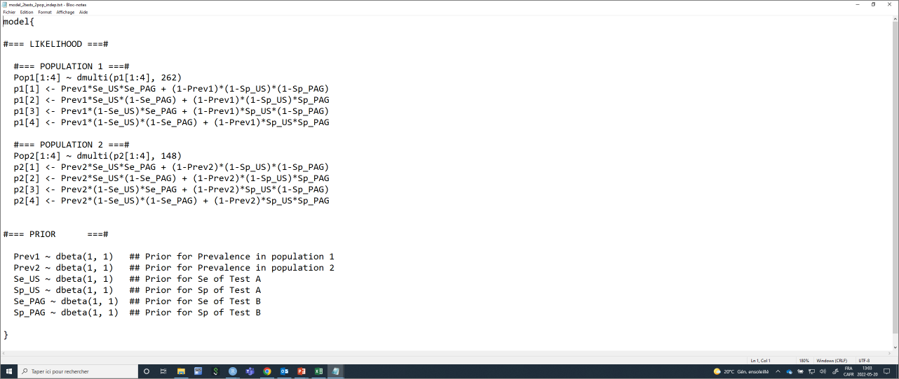
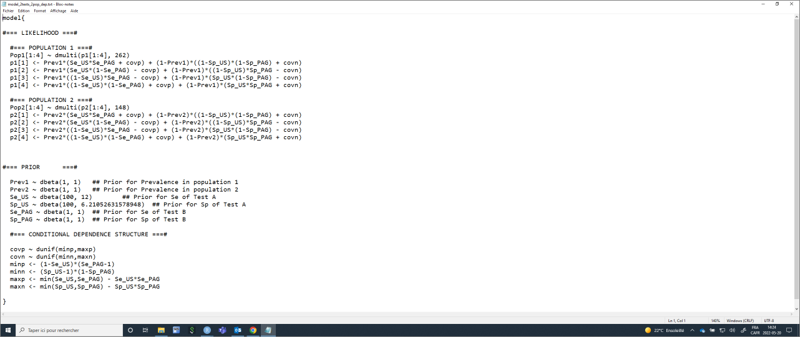

```{r include=FALSE}
# automatically create a bib database for R packages
knitr::write_bib(c(
  .packages(), 'bookdown', 'knitr', 'rmarkdown'
), 'packages.bib')
```


# Multiple populations
  
In some situations, the diagnostic tests will be applied in two or more populations with different disease prevalence. In such cases, it could be reasonable to assume that:  
  
- The prevalence varies from one population to another  
- The tests Se and Sp are constant from one population to another  
  
It could then be advantageous to model the different populations simultaneously in a same LCM as described by [Hui and Walter (1980)](https://www.jstor.org/stable/2530508?seq=1). With two populations, we would have six unknown parameters (*SeA* and *SpA*, *SeB* and *SpB*, and each population's prevalence, *P1* and *P2*). When conducting two diagnostic tests in two populations, the data generated can be presented as two 2x2 tables presenting the cross-classified results of the two tests.  
  
**Table.** Cross-classified results from two diagnostic tests in two populations.  
  
| **Population 1** |             |             |                | **Population 2** |             |             |
|:----------------:|:-----------:|:-----------:|:--------------:|:----------------:|:-----------:|:-----------:|
|                  | **Test A+** | **Test A-** |                |                  | **Test A+** | **Test A-** |
|    **Test B+**   |   Pop1 n1   |   Pop1 n3   |                |    **Test B+**   |   Pop2 n1   |   Pop2 n3   |
|    **Test B-**   |   Pop1 n2   |   Pop1 n4   |                |    **Test B-**   |   Pop2 n2   |   Pop2 n4   |  
  
We can see from these 2x2 tables that we have 6 degrees of freedom available. Indeed, in each of the 2x2 table, we have three cells that do contribute a valuable information and the information in the 4th cell can be "guessed" using the total number of observations minus the content of the other three cells. The model proposed by [Hui and Walter (1980)](https://www.jstor.org/stable/2530508?seq=1) is, therefore, barely identifiable. 
  
[Cheung et al. (2021)](https://doi.org/10.20506/rst.40.1.3224) have described how the number of unknown parameters and degrees of freedom vary as function of the number of populations studied when comparing two conditionally independent diagnostic tests (see below).   
  
**Table.** Number of degrees of freedom and of unknown parameters when comparing two conditionally independent diagnostic tests across various number of populations (adapted from [Cheung et al. (2021)](https://doi.org/10.20506/rst.40.1.3224)).  
  
| **Number of Populations** | **Number of unknown parameters (np)** | **Number of degrees of freedom (df)** | **Minimum number of informative priors needed** |
|:-------------------------:|:-------------------------------------:|:-------------------------------------:|:-----------------------------------------------:|
|             1             |                   5                   |                   3                   |                        2                        |
|             2             |                   6                   |                   6                   |                        0                        |
|             3             |                   7                   |                   9                   |                        0                        |
|             4             |                   8                   |                   12                  |                        0                        |
|             p             |                  4+p                  |                  3*p                  |              if df < np, then np-df             |  
  

## Likelihood function with 2 (or more) populations
With two populations, the likelihood function that could be used to link the observed data (*Pop1 n1*, *Pop1 n2*, ..., *Pop2 n4*) to the unknown parameters (*SeA* and *SpA*, *SeB* and *SpB*, and *P1* and *P2*) can be described as follows:  
  
$Ppop1[1:4] \sim dmulti(Pop1[1:4], nPop1)$  
$Ppop1_1 = P1*SeA*SeB + (1-P1)*(1-SpA)*(1-SpB)$  
$Ppop1_2 = P1*SeA*(1-SeB) + (1-P1)*(1-SpA)*SpB$  
$Ppop1_3 = P1*(1-SeA)*SeB + (1-P1)*SpA*(1-SpB)$  
$Ppop1_4 = P1*(1-SeA)*(1-SeB) + (1-P1)*SpA*SpB$  

$Ppop2[1:4] \sim dmulti(Pop2[1:4], nPop2)$  
$Ppop2_1 = P2*SeA*SeB + (1-P2)*(1-SpA)*(1-SpB)$  
$Ppop2_2 = P2*SeA*(1-SeB) + (1-P2)*(1-SpA)*SpB$  
$Ppop2_3 = P2*(1-SeA)*SeB + (1-P2)*SpA*(1-SpB)$  
$Ppop2_4 = P2*(1-SeA)*(1-SeB) + (1-P2)*SpA*SpB$  
  
Where $Ppop1_1$ to $Ppop1_4$ and $Ppop2_1$ to $Ppop2_4$ are the probabilities of falling in a given cell of the 2x2 table in population 1 and population 2, respectively; and $nPop1$ and $nPop2$ are the number of individuals tested in population 1 and 2, respectively. Thus, if you look carefully, **we simply duplicated the likelihood function used before and we added subscripts to differentiate the cells, probabilities, and disease prevalence of the two populations.** Cool hey? If you have three, four, etc populations, you can then extend the likelihood function to include them.   

## Organizing the data with 2 (or more) populations  
To run such a model, we simply need to provide, for each population, a dataset where *n1*, *n2*, *n3*, and *n4* are listed (in that order). For instance, if we use herd #1 and herd #2 from the PAG *vs.* US study, we have the following 2x2 tables:  
  
**Table.** Cross-classified results from the PAG and US diagnostic tests in herd #1 and herd #2.  
  
| **Herd 1** |         |         | **Total** |            | **Herd 2** |         |         | **Total** | 
|:----------:|:-------:|:-------:|:---------:|:----------:|:----------:|:-------:|:-------:|:---------:|
|            | **US+** | **US-** |           |            |            | **US+** | **US-** |           |
|  **PAG+**  |   138   |    10   |           |            |  **PAG+**  |    71   |    8    |           |
|  **PAG-**  |   1     |   113   |           |            |  **PAG-**  |    0    |    69   |           |
|  **Total** |         |         |    262    |            |  **Total** |         |         |    148    |
  
The dataset could, thus be created as follows:   
```{r}
#n is of the form : (TestA pos and TestB pos), (TestA pos and TestB neg), (TestA neg and TestB pos), then (TestA neg and TestB neg)
datalist <- list(Pop1=c(138,1,10,113),
                 Pop2=c(71, 0, 8, 69)
                 )

```
  
## The JAGS model with 2 (or more) populations
We could provide the values that will be used to described the prior distributions as we did before (so they are included in the model text file). The only difference is that we now have two prevalence parameters (*P1* and *P2*) to describe. In the example below, I will use vague priors for all parameters (just because we can!).    
  
```{r}
#We could first create labels for TestA and TestB
TestA <- "US"
TestB <- "PAG"

#Provide information for the prior distributions (all beta distributions) for the 6 unknown parameters 
Prev1.shapea <- 1         #a shape parameter for Prev in population 1    
Prev1.shapeb <- 1         #b shape parameter for Prev in population 1

Prev2.shapea <- 1         #a shape parameter for Prev in population 2    
Prev2.shapeb <- 1         #b shape parameter for Prev in population 2

Se.TestA.shapea <- 1     #a shape parameter for Se of TestA
Se.TestA.shapeb <- 1     #b shape parameter for Se of TestA
Sp.TestA.shapea <- 1     #a shape parameter for Sp of TestA
Sp.TestA.shapeb <- 1     #b shape parameter for Sp of TestA

Se.TestB.shapea <- 1     #a shape parameter for Se of TestB
Se.TestB.shapeb <- 1     #b shape parameter for Se of TestB
Sp.TestB.shapea <- 1     #a shape parameter for Sp of TestB
Sp.TestB.shapeb <- 1     #b shape parameter for Sp of TestB

#I will also need the total number of individuals tested in each population (nPop1 and nPop2)
n <- sapply(datalist, sum)
nPop1 <- n[1]
nPop2 <- n[2]

```
  
With that, we have everything that is needed to write the JAGS model. 
  
```{r}
#Create the JAGS text file
model_2tests_2pop_indep <- paste0("model{

#=== LIKELIHOOD	===#

  #=== POPULATION 1 ===#
  Pop1[1:4] ~ dmulti(p1[1:4], ",nPop1,")
  p1[1] <- Prev1*Se_", TestA, "*Se_", TestB, " + (1-Prev1)*(1-Sp_", TestA, ")*(1-Sp_", TestB, ")
  p1[2] <- Prev1*Se_", TestA, "*(1-Se_", TestB, ") + (1-Prev1)*(1-Sp_", TestA, ")*Sp_", TestB, "
  p1[3] <- Prev1*(1-Se_", TestA, ")*Se_", TestB, " + (1-Prev1)*Sp_", TestA, "*(1-Sp_", TestB, ")
  p1[4] <- Prev1*(1-Se_", TestA, ")*(1-Se_", TestB, ") + (1-Prev1)*Sp_", TestA, "*Sp_", TestB, "

  #=== POPULATION 2 ===#  
  Pop2[1:4] ~ dmulti(p2[1:4], ",nPop2,")
  p2[1] <- Prev2*Se_", TestA, "*Se_", TestB, " + (1-Prev2)*(1-Sp_", TestA, ")*(1-Sp_", TestB, ")
  p2[2] <- Prev2*Se_", TestA, "*(1-Se_", TestB, ") + (1-Prev2)*(1-Sp_", TestA, ")*Sp_", TestB, "
  p2[3] <- Prev2*(1-Se_", TestA, ")*Se_", TestB, " + (1-Prev2)*Sp_", TestA, "*(1-Sp_", TestB, ")
  p2[4] <- Prev2*(1-Se_", TestA, ")*(1-Se_", TestB, ") + (1-Prev2)*Sp_", TestA, "*Sp_", TestB, "
  
  
#=== PRIOR	===#

  Prev1 ~ dbeta(",Prev1.shapea,", ",Prev1.shapeb,") 	## Prior for Prevalence in population 1
  Prev2 ~ dbeta(",Prev2.shapea,", ",Prev2.shapeb,") 	## Prior for Prevalence in population 2
  Se_", TestA, " ~ dbeta(",Se.TestA.shapea,", ",Se.TestA.shapeb,") 	## Prior for Se of Test A
  Sp_", TestA, " ~ dbeta(",Sp.TestA.shapea,", ",Sp.TestA.shapeb,") 	## Prior for Sp of Test A
  Se_", TestB, " ~ dbeta(",Se.TestB.shapea,", ",Se.TestB.shapeb,") 	## Prior for Se of Test B
  Sp_", TestB, " ~ dbeta(",Sp.TestB.shapea,", ",Sp.TestB.shapeb,") 	## Prior for Sp of Test B
  
}")

#write as a text (.txt) file
write.table(model_2tests_2pop_indep, 
            file="model_2tests_2pop_indep.txt", 
            quote=FALSE, 
            sep="", 
            row.names=FALSE,
            col.names=FALSE)

```
  
With this code, you could, again, simply modify the labels for Test A and Test B, and the shape parameters for the prior distributions. The text file with the JAGS model will automatically be updated. Currently, it looks like this:  
  

  
Again, we will need to provide a list of initial values (one per Markov chain) for all unknown parameters. Careful again, we now have two prevalence (*Prev1* and *Prev2*).    
  
```{r}
#Initializing values for the parameters Prev, and the Ses and Sps of the two tests for the 3 chains.
inits <- list(list(Prev1=0.50,
              Prev2=0.50,
              Se_US=0.90,
              Sp_US=0.90,
              Se_PAG=0.90,
              Sp_PAG=0.90),
              
              list(Prev1=0.60,
              Prev2=0.60,
              Se_US=0.80,
              Sp_US=0.80,
              Se_PAG=0.80,
              Sp_PAG=0.80),
              
              list(Prev1=0.40,
              Prev2=0.40,
              Se_US=0.70,
              Sp_US=0.70,
              Se_PAG=0.70,
              Sp_PAG=0.70)
              )
```
  
We can run the model using `jags()` function as seen before.  
  
```{r, message=FALSE, warning=FALSE, results=FALSE}
library(R2jags)
library(coda)

#Run the Bayesian model
bug.out <- jags(data=datalist,                             
               model.file="model_2tests_2pop_indep.txt",     
               parameters.to.save=c("Prev1", "Prev2", "Se_US", "Sp_US", "Se_PAG", "Sp_PAG"),               
               n.chains=3,                                 
               inits=inits,                                
               n.iter=11000,                                
               n.burnin=1000,                              
               n.thin=1,                                   
               DIC=FALSE)                                   
```
  
Then we could produce the diagnostic plots, compute the ESS, and print out our results as we did previously (results not shown).
  
```{r, message=FALSE, warning=FALSE, results=FALSE}
library(mcmcplots)
bug.mcmc <- as.mcmc(bug.out)          
mcmcplot(bug.mcmc, title="Diagnostic plots") 
effectiveSize(bug.mcmc)
print(bug.out, digits.summary=3) 
```
  
## Conditional dependence
As discussed before, an important assumption of the LCM described in the preceding section is that diagnostic tests are conditionally independent. This assumption, however, can be relaxed using the method proposed by [Dendukuri and Joseph (2001)](https://onlinelibrary.wiley.com/doi/10.1111/j.0006-341X.2001.00158.x). Note that, we are now increasing the number of unknown parameters and we will, therefore, have to provide additional informative distributions.

**Table.** Number of degrees of freedom and of unknown parameters when comparing two **conditionally dependent** diagnostic tests across various number of populations (adapted from [Cheung et al. (2021)](https://doi.org/10.20506/rst.40.1.3224)).  
  
| **Number of Populations** | **Number of unknown parameters (np)** | **Number of degrees of freedom (df)** | **Minimum number of informative priors needed** |
|:-------------------------:|:-------------------------------------:|:-------------------------------------:|:-----------------------------------------------:|
|             1             |                   7                   |                   3                   |                        4                        |
|             2             |                   8                   |                   6                   |                        2                        |
|             3             |                   9                   |                   9                   |                        0                        |
|             4             |                   10                  |                   12                  |                        0                        |
|             p             |                  4+2+p                |                  3*p                  |              if df < np, then np-df             |  
  
For this example, in addition to specifying priors for *covp* and *covn*, I will add informative priors on US *Se* and *Sp*.  
  
```{r, message=FALSE, warning=FALSE}
library(epiR)
# US sensitivity ----------------------------------------------------------
# Sensitivity of US:  Mode=0.90, and we are 97.5% sure >0.85 
Se.US <- epi.betabuster(mode=0.90, conf=0.975, greaterthan=T, x=0.85)  

# US specificity ----------------------------------------------------------
# Specificity of US:  Mode=0.95, and we are 97.5% sure >0.90 
Sp.US <- epi.betabuster(mode=0.95, conf=0.975, greaterthan=T, x=0.90)  

Se.TestA.shapea <- Se.US$shape1     #a shape parameter for Se of TestA
Se.TestA.shapeb <- Se.US$shape2     #b shape parameter for Se of TestA
Sp.TestA.shapea <- Sp.US$shape1     #a shape parameter for Sp of TestA
Sp.TestA.shapeb <- Sp.US$shape2     #b shape parameter for Sp of TestA
```
  
The model would then be modified as follows (we simply added the *covp* and *covn* parameters in the likelihood function, and specified prior distributions for these):  
  
```{r}
#Create the JAGS text file
model_2tests_2pop_dep <- paste0("model{

#=== LIKELIHOOD	===#

  #=== POPULATION 1 ===#
  Pop1[1:4] ~ dmulti(p1[1:4], ",nPop1,")
  p1[1] <- Prev1*(Se_", TestA, "*Se_", TestB, " + covp) + (1-Prev1)*((1-Sp_", TestA, ")*(1-Sp_", TestB, ") + covn)
  p1[2] <- Prev1*(Se_", TestA, "*(1-Se_", TestB, ") - covp) + (1-Prev1)*((1-Sp_", TestA, ")*Sp_", TestB, " - covn)
  p1[3] <- Prev1*((1-Se_", TestA, ")*Se_", TestB, " - covp) + (1-Prev1)*(Sp_", TestA, "*(1-Sp_", TestB, ") - covn)
  p1[4] <- Prev1*((1-Se_", TestA, ")*(1-Se_", TestB, ") + covp) + (1-Prev1)*(Sp_", TestA, "*Sp_", TestB, " + covn)

  #=== POPULATION 2 ===#  
  Pop2[1:4] ~ dmulti(p2[1:4], ",nPop2,")
  p2[1] <- Prev2*(Se_", TestA, "*Se_", TestB, " + covp) + (1-Prev2)*((1-Sp_", TestA, ")*(1-Sp_", TestB, ") + covn)
  p2[2] <- Prev2*(Se_", TestA, "*(1-Se_", TestB, ") - covp) + (1-Prev2)*((1-Sp_", TestA, ")*Sp_", TestB, " - covn)
  p2[3] <- Prev2*((1-Se_", TestA, ")*Se_", TestB, " - covp) + (1-Prev2)*(Sp_", TestA, "*(1-Sp_", TestB, ") - covn)
  p2[4] <- Prev2*((1-Se_", TestA, ")*(1-Se_", TestB, ") + covp) + (1-Prev2)*(Sp_", TestA, "*Sp_", TestB, " + covn)

  
  
#=== PRIOR	===#

  Prev1 ~ dbeta(",Prev1.shapea,", ",Prev1.shapeb,") 	## Prior for Prevalence in population 1
  Prev2 ~ dbeta(",Prev2.shapea,", ",Prev2.shapeb,") 	## Prior for Prevalence in population 2
  Se_", TestA, " ~ dbeta(",Se.TestA.shapea,", ",Se.TestA.shapeb,") 	## Prior for Se of Test A
  Sp_", TestA, " ~ dbeta(",Sp.TestA.shapea,", ",Sp.TestA.shapeb,") 	## Prior for Sp of Test A
  Se_", TestB, " ~ dbeta(",Se.TestB.shapea,", ",Se.TestB.shapeb,") 	## Prior for Se of Test B
  Sp_", TestB, " ~ dbeta(",Sp.TestB.shapea,", ",Sp.TestB.shapeb,") 	## Prior for Sp of Test B
  
  #=== CONDITIONAL DEPENDENCE STRUCTURE ===#

  covp ~ dunif(minp,maxp)
  covn ~ dunif(minn,maxn)
  minp <- (1-Se_", TestA, ")*(Se_", TestB, "-1)
  minn <- (Sp_", TestA, "-1)*(1-Sp_", TestB, ")
  maxp <- min(Se_", TestA, ",Se_", TestB, ") - Se_", TestA, "*Se_", TestB, "	
  maxn <- min(Sp_", TestA, ",Sp_", TestB, ") - Sp_", TestA, "*Sp_", TestB, "  
  
}")

#write as a text (.txt) file
write.table(model_2tests_2pop_dep, 
            file="model_2tests_2pop_dep.txt", 
            quote=FALSE, 
            sep="", 
            row.names=FALSE,
            col.names=FALSE)

```
  
This text file looks like this:  
  

  
Again, the list of initial values will have to be modified to include (*covp* and *covn*).    
  
```{r}
#Initializing values for the parameters Prev, and the Ses and Sps of the two tests for the 3 chains.
inits <- list(list(Prev1=0.50,
              Prev2=0.50,
              Se_US=0.90,
              Sp_US=0.90,
              Se_PAG=0.90,
              Sp_PAG=0.90,
              covp=0.0,
              covn=0.0),
              
              list(Prev1=0.60,
              Prev2=0.60,
              Se_US=0.80,
              Sp_US=0.80,
              Se_PAG=0.80,
              Sp_PAG=0.80,
              covp=0.01,
              covn=0.01),
              
              list(Prev1=0.40,
              Prev2=0.40,
              Se_US=0.70,
              Sp_US=0.70,
              Se_PAG=0.70,
              Sp_PAG=0.70,
              covp=0.05,
              covn=0.05)
              )
```
  
And, when running the model using `jags()`, we would also ask to monitor *covp* and *covn*. Note that I have increased the number of iterations / burn-in period (remember the autocorrelation problem seen with LCM with a covariance between test?).   
  
```{r, message=FALSE, warning=FALSE}
library(R2jags)
library(coda)

#Run the Bayesian model
bug.out <- jags(data=datalist,                             
               model.file="model_2tests_2pop_dep.txt",     
               parameters.to.save=c("Prev1", "Prev2", "Se_US", "Sp_US", "Se_PAG", "Sp_PAG", "covp", "covn"),               
               n.chains=3,                                 
               inits=inits,                                
               n.iter=210000,                                
               n.burnin=10000,                              
               n.thin=1,                                   
               DIC=FALSE)                                   
```
  
Then we could produce the diagnostic plots, compute the ESS, and print out our results as we did previously (results not shown).
  
```{r, message=FALSE, warning=FALSE, results=FALSE}
library(mcmcplots)
bug.mcmc <- as.mcmc(bug.out)          
mcmcplot(bug.mcmc, title="Diagnostic plots") 
effectiveSize(bug.mcmc)
print(bug.out, digits.summary=3) 
``` 
