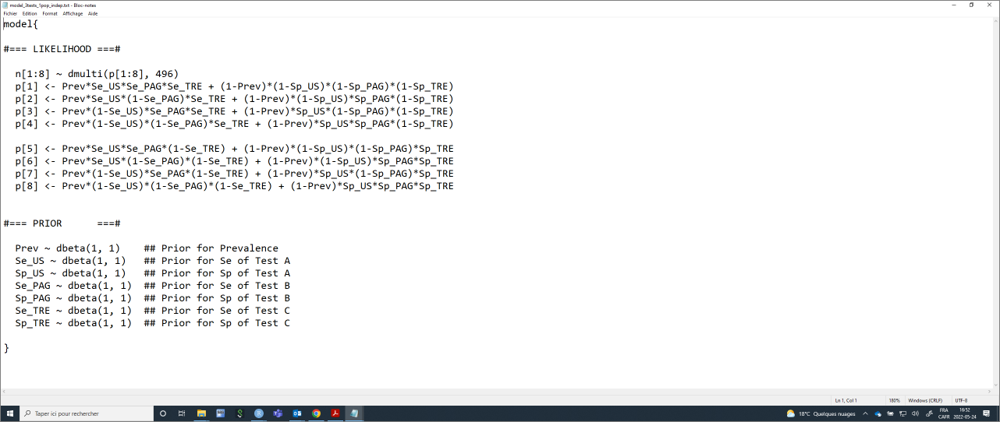

```{r include=FALSE}
# automatically create a bib database for R packages
knitr::write_bib(c(
  .packages(), 'bookdown', 'knitr', 'rmarkdown'
), 'packages.bib')
```


# Multiple diagnostic tests
  
In some situations, individuals studied will be tested using more than two diagnostic tests. For instance, if all individuals were tested using three different diagnostic tests (Test A, Test B, and Test C) we could present the cross-classified results of the three tests as follows:  
  
**Table.** Cross-classified results from three diagnostic tests in one population.  
  
| **Test C+** |             |             |   | **Test C-** |             |             |
|:-----------:|:-----------:|:-----------:|:-:|:-----------:|:-----------:|:-----------:|
|             | **Test A+** | **Test A-** |   |             | **Test A+** | **Test A-** |
| **Test B+** |      n1     |      n3     |   | **Test B+** |      n5     |      n7     |
| **Test B-** |      n2     |      n4     |   | **Test B-** |      n6     |      n8     |  
  
Contrarily to the case where we had two tests in 2 populations, we can see from the preceding table that we have 7 degrees of freedom available. Indeed, we need to know the total number of individuals (*n*) and the content of seven of the eight cells to "guess" the value in the last cell. Moreover, with three diagnostic tests, we would have seven unknown parameters (*SeA* and *SpA*, *SeB* and *SpB*, *SeC* and *SpC*,and the population's prevalence, *P*) to estimate. The model is, therefore, identifiable.  Again, we can refer to [Cheung et al. (2021)](https://doi.org/10.20506/rst.40.1.3224) to describe how the number of unknown parameters and degrees of freedom vary as function of the number of diagnostic tests used (see below).   
  
**Table.** Number of degrees of freedom and of unknown parameters when comparing an increasing number of conditionally independent diagnostic tests in one single population (adapted from [Cheung et al. (2021)](https://doi.org/10.20506/rst.40.1.3224)).  
  
| **Number of Tests** | **Number of unknown parameters (np)** | **Number of degrees of freedom (df)** | **Minimum number of informative priors needed** |
|:-------------------:|:-------------------------------------:|:-------------------------------------:|:-----------------------------------------------:|
|          2          |                   5                   |                   3                   |                        2                        |
|          3          |                   7                   |                   7                   |                        0                        |
|          4          |                   9                   |                   15                  |                        0                        |
|          k          |                 2*k+1                 |                 2^k -1                |              if df < np, then np-df             |  
  
As you can see, adding diagnostic tests could be an extremely valuable option to make a LCM identifiable. The gain in statistical power, however, will be maximized if:  
  
  -We used many **conditionally independent** diagnostic tests  
  -The sample size is sufficient so **all tests combinations are represented** (i.e., no empty cells in the table presenting the cross-classified results)  
  
## Likelihood function with 3 tests
With three diagnostic tests applied to a single population, the likelihood function that could be used to link the observed data (*n1*, ..., *n8*) to the unknown parameters (*SeA* and *SpA*, *SeB* and *SpB*, *SeC* and *SpC*,and *P*) can be described as follows:  
  
$n[1:8] \sim dmulti(P[1:8], n)$ 
  
$P1 = P*SeA*SeB*SeC + (1-P)*(1-SpA)*(1-SpB)*(1-SpC)$  
$P2 = P*SeA*(1-SeB)*SeC + (1-P)*(1-SpA)*SpB*(1-SpC)$  
$P3 = P*(1-SeA)*SeB*SeC + (1-P)*SpA*(1-SpB)*(1-SpC)$  
$P4 = P*(1-SeA)*(1-SeB)*SeC + (1-P)*SpA*SpB*(1-SpC)$  
$P5 = P*SeA*SeB*(1-SeC) + (1-P)*(1-SpA)*(1-SpB)*SpC$  
$P6 = P*SeA*(1-SeB)*(1-SeC) + (1-P)*(1-SpA)*SpB*SpC$  
$P7 = P*(1-SeA)*SeB*(1-Sec) + (1-P)*SpA*(1-SpB)*SpC$  
$P8 = P*(1-SeA)*(1-SeB)*(1-SeC) + (1-P)*SpA*SpB*SpC$  
  
Again, if we put that in words, the number of individuals in cell *n1* (i.e., TestA+ and TestB+ and TestC+) is determined by the number of individuals tested (*n*) and the probability (*P1*) of falling in that cell. The latter itself depends on the true prevalence of disease in the population (*P*), and on each of the tests sensitivity (*SeA*, *SeB*, and *SeC*) and specificity (*SpA*, *SpB*, and *SpC*). We can use similar reasoning for *n2* to *n8*. Finally, the multinomial distribution would further impose that the eight probabilities (*P1* to *P8*) have to sum up to 1.0 (i.e., 100%).  
  
## Organizing the data with 3 tests
To run such a model, we simply need to provide a dataset where *n1*, *n2*, *n3*, *n4*, *n5*, *n6*, *n7*, and *n8* are listed (in that order). For instance, in the PAG *vs.* US study, we have a number of cows that also had a conventional transrectal exam (**TRE**). The results of the three tests can be presented as follows:  
  
**Table.** Cross-classified results from a PAG, US, and TRE diagnostic tests in one population.  
  
| **TRE+** |         |         |   | **TRE-** |         |         |
|:--------:|:-------:|:-------:|:-:|:--------:|:-------:|:-------:|
|          | **US+** | **US-** |   |          | **US+** | **US-** |
| **PAG+** |   240   |    12   |   | **PAG+** |    15   |    9    |
| **PAG-** |    1    |    2    |   | **PAG-** |    1    |   216   |  
  
The dataset could, thus be created as follows:   
```{r}
#n is of the form : (TestA+ TestB+ Test C+), (TestA+ TestB- TestC+), (TestA- TestB+ TestC+), (TestA- TestB- TestC+), (TestA+ TestB+ TestC-), (TestA+ TestB- TestC-), (TestA- TestB+ TestC-), (TestA- Test- TestC-)
datalist <- list(n=c(240, 1, 12, 2, 15, 1, 9, 216))

```
  
## The JAGS model with 3 tests
Again, we could provide the values that will be used to describe the prior distributions as we did before (they will then become included in the LCM text file). The only difference is that we now have three Se and Sp to describe. In the example below, I will use vague priors for all parameters. 
  
```{r}
#We could first create labels for TestA, TestB, and TestC
TestA <- "US"
TestB <- "PAG"
TestC <- "TRE"

#Provide information for the prior distributions (all beta distributions) for the 7 unknown parameters 
Prev.shapea <- 1         #a shape parameter for Prev     
Prev.shapeb <- 1         #b shape parameter for Prev 

Se.TestA.shapea <- 1     #a shape parameter for Se of TestA
Se.TestA.shapeb <- 1     #b shape parameter for Se of TestA
Sp.TestA.shapea <- 1     #a shape parameter for Sp of TestA
Sp.TestA.shapeb <- 1     #b shape parameter for Sp of TestA

Se.TestB.shapea <- 1     #a shape parameter for Se of TestB
Se.TestB.shapeb <- 1     #b shape parameter for Se of TestB
Sp.TestB.shapea <- 1     #a shape parameter for Sp of TestB
Sp.TestB.shapeb <- 1     #b shape parameter for Sp of TestB

Se.TestC.shapea <- 1     #a shape parameter for Se of TestC
Se.TestC.shapeb <- 1     #b shape parameter for Se of TestC
Sp.TestC.shapea <- 1     #a shape parameter for Sp of TestC
Sp.TestC.shapeb <- 1     #b shape parameter for Sp of TestC

#I will also need the total number of individuals tested 
n <- sapply(datalist, sum)

```

We now have everything that is needed to write the JAGS model.  

```{r}
#Create the JAGS text file
model_3tests_1pop_indep <- paste0("model{

#=== LIKELIHOOD	===#

  n[1:8] ~ dmulti(p[1:8], ",n,")
  p[1] <- Prev*Se_", TestA, "*Se_", TestB, "*Se_", TestC, " + (1-Prev)*(1-Sp_", TestA, ")*(1-Sp_", TestB, ")*(1-Sp_", TestC,")
  p[2] <- Prev*Se_", TestA, "*(1-Se_", TestB, ")*Se_", TestC, " + (1-Prev)*(1-Sp_", TestA, ")*Sp_", TestB, "*(1-Sp_", TestC,")
  p[3] <- Prev*(1-Se_", TestA, ")*Se_", TestB, "*Se_", TestC, " + (1-Prev)*Sp_", TestA, "*(1-Sp_", TestB, ")*(1-Sp_", TestC,")
  p[4] <- Prev*(1-Se_", TestA, ")*(1-Se_", TestB, ")*Se_", TestC, " + (1-Prev)*Sp_", TestA, "*Sp_", TestB, "*(1-Sp_", TestC,")
  
  p[5] <- Prev*Se_", TestA, "*Se_", TestB, "*(1-Se_", TestC,") + (1-Prev)*(1-Sp_", TestA, ")*(1-Sp_", TestB, ")*Sp_", TestC,"
  p[6] <- Prev*Se_", TestA, "*(1-Se_", TestB, ")*(1-Se_", TestC,") + (1-Prev)*(1-Sp_", TestA, ")*Sp_", TestB, "*Sp_", TestC,"
  p[7] <- Prev*(1-Se_", TestA, ")*Se_", TestB, "*(1-Se_", TestC,") + (1-Prev)*Sp_", TestA, "*(1-Sp_", TestB, ")*Sp_", TestC,"
  p[8] <- Prev*(1-Se_", TestA, ")*(1-Se_", TestB, ")*(1-Se_", TestC,") + (1-Prev)*Sp_", TestA, "*Sp_", TestB, "*Sp_", TestC,"
  
  
#=== PRIOR	===#

  Prev ~ dbeta(",Prev.shapea,", ",Prev.shapeb,") 	## Prior for Prevalence
  Se_", TestA, " ~ dbeta(",Se.TestA.shapea,", ",Se.TestA.shapeb,") 	## Prior for Se of Test A
  Sp_", TestA, " ~ dbeta(",Sp.TestA.shapea,", ",Sp.TestA.shapeb,") 	## Prior for Sp of Test A
  Se_", TestB, " ~ dbeta(",Se.TestB.shapea,", ",Se.TestB.shapeb,") 	## Prior for Se of Test B
  Sp_", TestB, " ~ dbeta(",Sp.TestB.shapea,", ",Sp.TestB.shapeb,") 	## Prior for Sp of Test B
  Se_", TestC, " ~ dbeta(",Se.TestC.shapea,", ",Se.TestC.shapeb,") 	## Prior for Se of Test C
  Sp_", TestC, " ~ dbeta(",Sp.TestC.shapea,", ",Sp.TestC.shapeb,") 	## Prior for Sp of Test C
  
}")

#write as a text (.txt) file
write.table(model_3tests_1pop_indep, 
            file="model_3tests_1pop_indep.txt", 
            quote=FALSE, 
            sep="", 
            row.names=FALSE,
            col.names=FALSE)

```
  
With this code, you could, again, simply modify the labels for Test A, Test B, and Test C, and the shape parameters for the prior distributions. The text file with the JAGS model will automatically be updated. Currently, it looks like this:  
  
  
  
<br/>     
Again, we will need to provide a list of initial values (one per Markov chain) for all unknown parameters. Careful again, we now have three tests.    
  
```{r}
#Initializing values for the parameters Prev, and the Ses and Sps of the two tests for the 3 chains.
inits <- list(list(Prev=0.50,
              Se_US=0.90,
              Sp_US=0.90,
              Se_PAG=0.90,
              Sp_PAG=0.90,
              Se_TRE=0.90,
              Sp_TRE=0.90),
              
              list(Prev=0.60,
              Se_US=0.80,
              Sp_US=0.80,
              Se_PAG=0.80,
              Sp_PAG=0.80,
              Se_TRE=0.80,
              Sp_TRE=0.80),
              
              list(Prev=0.40,
              Se_US=0.70,
              Sp_US=0.70,
              Se_PAG=0.70,
              Sp_PAG=0.70,
              Se_TRE=0.70,
              Sp_TRE=0.70)
              )
```
  
We can run the model using `jags()` function as seen before.  
  
```{r, message=FALSE, warning=FALSE, results=FALSE}
library(R2jags)
library(coda)

#Run the Bayesian model
bug.out <- jags(data=datalist,                             
               model.file="model_3tests_1pop_indep.txt",     
               parameters.to.save=c("Prev", "Se_US", "Sp_US", "Se_PAG", "Sp_PAG", "Se_TRE", "Sp_TRE"),               
               n.chains=3,                                 
               inits=inits,                                
               n.iter=11000,                                
               n.burnin=1000,                              
               n.thin=1,                                   
               DIC=FALSE)                                   
```
  
Then we could produce the diagnostic plots, compute the ESS, and print out our results as we did previously (results not shown).
  
```{r, message=FALSE, warning=FALSE, results=FALSE}
library(mcmcplots)
bug.mcmc <- as.mcmc(bug.out)          
mcmcplot(bug.mcmc, title="Diagnostic plots") 
effectiveSize(bug.mcmc)
print(bug.out, digits.summary=3) 
```
  
## Conditional dependence
With LCM where >2 diagnostic tests are used, we could, again, relax the assumption of conditional independence by adding covariance terms representing the conditional dependence between tests [(Dendukuri and Joseph, 2001)](https://onlinelibrary.wiley.com/doi/10.1111/j.0006-341X.2001.00158.x). However, a LCM including every covariance term between every test is not always feasible. A more pragmatic approach would be to consider pair-wise covariance terms between two of the three tests.  
  
For instance, using the example from the preceding section, we could assume that US and TRE, which are both based on recognition (tactile or visual) of the amniotic vesicle or embryo, are possibly conditionally **dependent** (as compared to the PAG test, which measure a glycoprotein associated with the placenta). We could thus include covariance terms between these two specific tests. Remember, we had set up US as Test A and TRE as Test C. It will be easier, however, to manage the covariance terms if the dependent tests are next to each other within the likelihood function. I will, therefore, re-assign the tests as follows, and reorganized the dataset with that new tests configuration.  
  -Test A: US  
  -Test B: TRE  
  -Test C: PAG  
    
  
```{r}

TestA <- "US"
TestB <- "TRE"
TestC <- "PAG"

#n is of the form : (TestA+ TestB+ Test C+), (TestA+ TestB- TestC+), (TestA- TestB+ TestC+), (TestA- TestB- TestC+), (TestA+ TestB+ Test C-), (TestA+ TestB- TestC-), (TestA- TestB+ TestC-), (TestA- TestB- TestC-)
datalist <- list(n=c(240, 15, 12, 9, 1, 1, 2, 216))
n <- sapply(datalist, sum)

#Create the JAGS text file
model_3tests_1pop_dep <- paste0("model{

#=== LIKELIHOOD	===#

  n[1:8] ~ dmulti(p[1:8], ",n,")
  p[1] <- Prev*(Se_", TestA, "*Se_", TestB, " + covp)*Se_", TestC, " + (1-Prev)*((1-Sp_", TestA, ")*(1-Sp_", TestB, ") + covn)*(1-Sp_", TestC,")
  p[2] <- Prev*(Se_", TestA, "*(1-Se_", TestB, ") - covp)*Se_", TestC, " + (1-Prev)*((1-Sp_", TestA, ")*Sp_", TestB, " - covn)*(1-Sp_", TestC,")
  p[3] <- Prev*((1-Se_", TestA, ")*Se_", TestB, " - covp)*Se_", TestC, " + (1-Prev)*(Sp_", TestA, "*(1-Sp_", TestB, ") - covn)*(1-Sp_", TestC,")
  p[4] <- Prev*((1-Se_", TestA, ")*(1-Se_", TestB, ") + covp)*Se_", TestC, " + (1-Prev)*(Sp_", TestA, "*Sp_", TestB, " + covn)*(1-Sp_", TestC,")
  
  p[5] <- Prev*(Se_", TestA, "*Se_", TestB, " + covp)*(1-Se_", TestC,") + (1-Prev)*((1-Sp_", TestA, ")*(1-Sp_", TestB, ") + covn)*Sp_", TestC,"
  p[6] <- Prev*(Se_", TestA, "*(1-Se_", TestB, ") - covp)*(1-Se_", TestC,") + (1-Prev)*((1-Sp_", TestA, ")*Sp_", TestB, " - covn)*Sp_", TestC,"
  p[7] <- Prev*((1-Se_", TestA, ")*Se_", TestB, " - covp)*(1-Se_", TestC,") + (1-Prev)*(Sp_", TestA, "*(1-Sp_", TestB, ") - covn)*Sp_", TestC,"
  p[8] <- Prev*((1-Se_", TestA, ")*(1-Se_", TestB, ") + covp)*(1-Se_", TestC,") + (1-Prev)*(Sp_", TestA, "*Sp_", TestB, " + covn)*Sp_", TestC,"
  
  
#=== PRIOR	===#

  Prev ~ dbeta(",Prev.shapea,", ",Prev.shapeb,") 	## Prior for Prevalence
  Se_", TestA, " ~ dbeta(",Se.TestA.shapea,", ",Se.TestA.shapeb,") 	## Prior for Se of Test A
  Sp_", TestA, " ~ dbeta(",Sp.TestA.shapea,", ",Sp.TestA.shapeb,") 	## Prior for Sp of Test A
  Se_", TestB, " ~ dbeta(",Se.TestB.shapea,", ",Se.TestB.shapeb,") 	## Prior for Se of Test B
  Sp_", TestB, " ~ dbeta(",Sp.TestB.shapea,", ",Sp.TestB.shapeb,") 	## Prior for Sp of Test B
  Se_", TestC, " ~ dbeta(",Se.TestC.shapea,", ",Se.TestC.shapeb,") 	## Prior for Se of Test C
  Sp_", TestC, " ~ dbeta(",Sp.TestC.shapea,", ",Sp.TestC.shapeb,") 	## Prior for Sp of Test C
  
  #=== CONDITIONAL DEPENDENCE STRUCTURE ===#

  covp ~ dunif(minp,maxp)
  covn ~ dunif(minn,maxn)
  minp <- (1-Se_", TestA, ")*(Se_", TestB, "-1)
  minn <- (Sp_", TestA, "-1)*(1-Sp_", TestB, ")
  maxp <- min(Se_", TestA, ",Se_", TestB, ") - Se_", TestA, "*Se_", TestB, "	
  maxn <- min(Sp_", TestA, ",Sp_", TestB, ") - Sp_", TestA, "*Sp_", TestB, "  
  
}")

#write as a text (.txt) file
write.table(model_3tests_1pop_dep, 
            file="model_3tests_1pop_dep.txt", 
            quote=FALSE, 
            sep="", 
            row.names=FALSE,
            col.names=FALSE)

```
  
The text file would look as follows:  
  
  
  
<br/>    
We could run the model using `jags()` function and then produce the diagnostic plots, compute the ESS, and print out our results as we did previously (results not shown).  
  
```{r, message=FALSE, warning=FALSE, results=FALSE}
library(R2jags)
library(coda)

#Run the Bayesian model
bug.out <- jags(data=datalist,                             
               model.file="model_3tests_1pop_dep.txt",     
               parameters.to.save=c("Prev", "Se_US", "Sp_US", "Se_PAG", "Sp_PAG", "Se_TRE", "Sp_TRE", "covp", "covn"),               
               n.chains=3,                                 
               inits=inits,                                
               n.iter=11000,                                
               n.burnin=1000,                              
               n.thin=1,                                   
               DIC=FALSE)                                   

library(mcmcplots)
bug.mcmc <- as.mcmc(bug.out)          
mcmcplot(bug.mcmc, title="Diagnostic plots") 
effectiveSize(bug.mcmc)
print(bug.out, digits.summary=3) 
```
  
In cases where you would like to consider potential conditional dependence between all tests, you could either:  
  
- Run a number of models where you include, each time, one pairwise conditional dependence. For instance, with three tests: 1) model with *TestA* *vs.* *TestB*; 2) model with *TestA* *vs.* *TestC*; and 3) model with *TestB* *vs.* *TestC*. If you are "lucky", perhaps just one (or none) pair of tests will yield covariance terms that are substantially different from 0.0. Then, a model with just one (or no) set of covariance terms could be used. 
  
- Include, in a single model, all potential covariance terms between 3 tests (or > 3 tests). For this, a different modelling approach will have to be used. As an example, [Denis-Robichaud et al. (2024)](https://doi.org/10.3168/jds.2024-24693) published a study where conditional dependence between 3 tests was allowed. The `R` script used for their analyses, along with the original dataset, was also published in this [Dataverse](https://doi.org/10.7910/DVN/EATTYD).  
